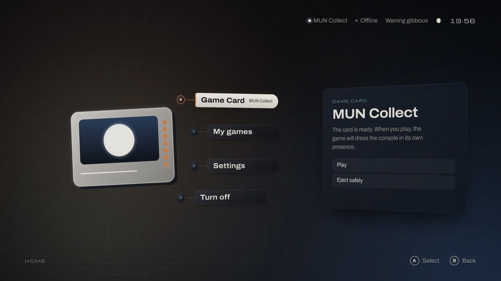

# MUN OS

**BOP — Buy. Own. Play.** MUN is a game console in development, for games
you own on Game Cards: insert a card, play offline, and your progress
travels with the card. MUN OS is its open-source operating system.

MUN OS is **experimental**. There is no MUN hardware and no supported
release yet. What exists is one development image, ARM64 like the console
will be, that QEMU runs as a virtual console on macOS, Linux and Windows
computers; the image says so itself (`environment = "qemu-arm64"`,
`release = false`).

MUN -1, the first console, will have **one officially supported hardware
configuration**, not selected yet; the assembled console and DIY builds on
that configuration will use the same official image. Ports to other
hardware are welcome as independently maintained forks.

## What works today

In the virtual console: MUN Shell starts on its own; Game Cards (disk images
standing in for cards) are validated and shown; a game on a card starts
sandboxed and hands the console back however it ends; saves are written to
the card and restored on another console or another build; a card is
ejected safely; the resolution (720p, 1080p, 1440p) applies at once, and
games built on SDL or OpenGL start in it; the menus have sound; English and
Spanish. The examples are MUN Collect, a small game, and a graphics and
audio probe.

Not there yet: controllers, card and system updates, and any physical
hardware. [Architecture](docs/architecture.md) says what exists and what is
planned.

## Where to start

- **Try the preview.** Download the tools and the image of a
  [preview release](https://github.com/Play-MUN/mun-os/releases), start the
  console and play the Game Card that comes with it; no compiler needed.
  [Getting started](docs/getting-started.md) has the steps for each
  computer.
- **Make a Game Card.** Put a game on a card, play it, save on it, eject it
  and continue, with MUN Collect as the example:
  [create a Game Card](docs/guides/create-game-card.md), then
  [bring a game to MUN](docs/guides/port-a-game.md).
- **Build the image.** Compose it yourself from pinned inputs, on a Mac with
  Apple Silicon: [build the image yourself](docs/getting-started.md#build-the-image-yourself)
  and [image build](os/README.md).
- **Contribute.** Run the checks, pick an issue, open a pull request:
  [contributing](CONTRIBUTING.md).

## Where it runs

Every computer below runs the same image with the same tools; only how QEMU
is installed differs ([getting started](docs/getting-started.md#1-what-you-need)).
QEMU runs the console with the processor's own virtualization on an ARM64
computer whose system offers it to QEMU (macOS on Apple Silicon, Linux with
KVM); otherwise, on x86_64 and on ARM64 alike, it emulates the processor:
the same console, slower.

| Your computer | The console's processor | Checked |
| --- | --- | --- |
| macOS, Apple Silicon | Virtualized (HVF) | On a Mac (macOS 27), with window and sound; in CI on macOS 15, headless and emulated (no HVF in a VM) |
| Linux, x86_64 or ARM64 | Emulated; KVM on ARM64 not tried yet | In CI and in Ubuntu 24.04 virtual machines, headless |
| Windows, x86_64 or ARM64 | Emulated | In CI (Windows Server 2025; Windows 11 ARM64), headless |

"In CI" is the Hosts workflow: download a preview, start the console, play
its card, power off, in GitHub's virtual machines. No Linux or Windows
computer has been tried yet. Playing, making cards and building images each
have their own requirements: [compatibility](docs/compatibility.md).

## Principles

- A legitimate Game Card can start its offline-capable game without an
  account or an activation server. Optional online features must be
  explicit.
- Saves live on the card and travel between consoles.
- The console's internal storage is for the system, recovery, bounded caches
  and scratch space, not for installing the player's library.
- Updates, once they exist, keep the original version of a game available.
- Common software depends on MUN and Linux contracts; boot, GPU, NPU, reader
  and thermal details belong to the hardware integration.
- Game data a player supplies is separate from MUN's software: MUN OS
  carries no game but its own examples.

## Documentation

- [Getting started](docs/getting-started.md) and [compatibility](docs/compatibility.md)
- [Create a Game Card](docs/guides/create-game-card.md) and
  [bring a game to MUN](docs/guides/port-a-game.md)
- For card and game authors: [Game Cards](docs/game-cards.md),
  [saves](docs/saves.md), [running a game](docs/runtime.md)
- [Architecture](docs/architecture.md), [image build](os/README.md),
  [laboratory](vm/README.md) and [every document](docs/README.md)
- [Licensing](docs/licensing.md), [security](SECURITY.md),
  [contributing](CONTRIBUTING.md)

## Repository map

| Location | Responsibility |
| --- | --- |
| `services/` | MUN Shell, the card service and the launcher |
| `tools/` | `mun-card` and the shared card package |
| `os/` | MUN OS image composition: pinned inputs, mkosi configuration, builder scripts |
| `vm/` | The laboratory: builder VMs, image guests, virtual cards, downloads |
| `mun` | The tools' entry point: `./mun get`, `./mun play`, `./mun card`, `./mun dev` |
| `examples/` | Example games |
| `tests/`, `scripts/` | Host regressions and the documentation check |
| `docs/` | Guides, contracts, architecture and reference |
| `.local/` | Ignored: builds, guests, card images, downloads |

`make check` (Python 3.9 or later, Make) runs the documentation check, the
Python syntax check, the host regressions and, with a C compiler, the example
game's save tests: no network, no VM.

## Who makes it, and the licence

MUN is made by **Play MUN**, the studio of **Iván Moreno Mendoza**, who
founded the project and maintains MUN OS: he reviews the changes and decides
what goes into its official version. MUN OS's own work is Copyright 2026
Iván Moreno Mendoza, licensed under the [Apache License 2.0](LICENSE)
([NOTICE](NOTICE)); contributions stay their authors' and are licensed under
the same terms. Third-party components (typefaces, Debian packages) keep
their own terms, and the Apache License grants no rights to the MUN name or
logo, which have [their own terms](NAME-AND-LOGO.txt):
[licensing](docs/licensing.md).

The project had another name before. Game Cards made then carry
`neptune.toml`, save as `neptune-save/1` and hand their games `NEPTUNE_*`
variables; the console still reads and plays them, and `mun-card convert`
makes a MUN copy on request
([naming generations](docs/game-cards.md#naming-generations)).
