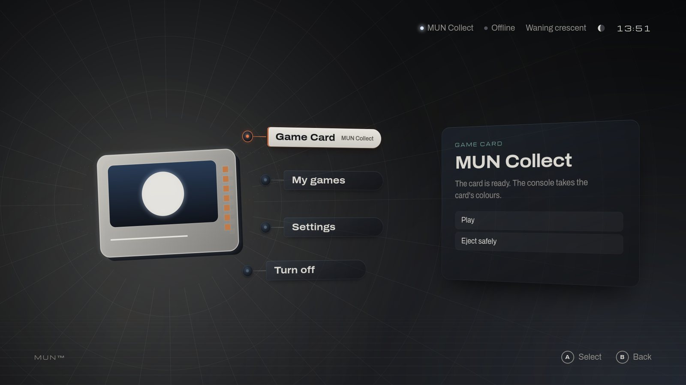
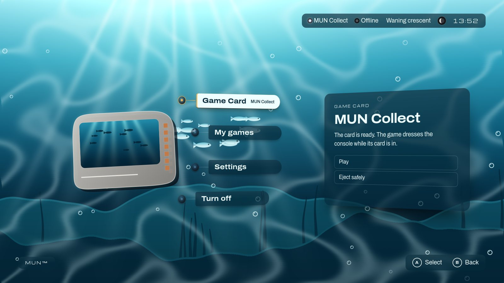

# See MUN Shape in action

**English** · [Español](../es/guides/see-shape-in-action.md)

How a Game Card that carries MUN Shape is laid out, whatever the game, and
how to watch a console take that game's identity: start a console with no
card, put the card in, play, come back, eject, turn off. To make a package
of your own, follow [dress the console in your game](shape-your-game.md);
the rules are in [MUN Shape](../shape.md).

| MUN Collect, without a package | The same card with the `sea` sample |
| --- | --- |
|  |  |

## What a dressed card holds

The console reads one folder: `mun-shape/` inside the card's content root,
the folder the manifest names. Nothing in the console knows which game it
is; the same reading serves every card that has that folder.

A small game, its executable in the content, made with `./mun card create
… --game FILE --shape DIR` (here MUN Collect dressed in the `sea` sample):

```text
mun.toml                  the manifest: identity, runtime profile, entry content/mun-collect
cover.png                 the cover
content/
  mun-collect             the game
  README.txt, assets/ …   the game's own files
  mun-shape/              MUN Shape: what the console reads to dress itself
    shape.json            format "mun-shape/1": palette, card, world, surfaces, transition, sounds
    card/window.png       the card object's screen
    world/backdrop.png    the world behind Home …
    world/…               … its layers, sprites and light textures
    sfx/move.wav          the menus' sounds …
    sfx/enter.wav
    sfx/back.wav
    sfx/insert.wav        … and the insertion cue
saves/                    the saves, written by the console
```

A larger game whose data is a folder, made with `./mun card create …
--variant game-gl --content DIR`, where `DIR` holds the game, its data and
`mun-shape/`:

```text
mun.toml                  (or neptune.toml on a card of the earlier naming generation)
cover.png
content/
  mygame                  the game's executable
  data/, gfx/, sfx/, …    the game's data, as the game expects it
  mun-shape/              the same folder, the same files as above
    shape.json
    card/  world/  sfx/
saves/
```

The package sits beside the game's files and changes none of them. A card
without `mun-shape/` is played in MUN's look (with the colours its
manifest lends, or a palette read from its cover). A package the console
cannot use is dropped block by block, and the card stays valid.

## The console must show MUN Shape

An image records the MUN Shape its console reads in its `BUILD-INFO.json`
(`"shape": {"format": "mun-shape/1"}`). v0.1.0-dev.3 records it, as do
images built from this checkout; earlier previews, v0.1.0-dev.2 and before,
do not show MUN Shape. List what you have:

```sh
./mun dev list        # each build and guest: "shape mun-shape/1" or "shape not recorded"
```

If none records it, get v0.1.0-dev.3
([getting started](../getting-started.md#3-the-image)) or build one with
`./mun dev build`
([build the image yourself](../getting-started.md#build-the-image-yourself)).

## Watch it

1. **A console with no card.** Start it in a window:

   ```sh
   ./mun play                     # the guest `play`, made the first time from your latest image
   ```

   A guest keeps the image it was made from; if that image does not show
   MUN Shape, make a new guest: `./mun play --guest NAME` (and the same name
   in the commands below).

2. **Put the card in**, once Home is on screen, from another terminal:

   ```sh
   ./mun dev vm play card-attach mygame       # .local/gamecards/mygame.img
   ```

   The card is read, the card object takes the package's window, the
   transition brings the identity in from the object outwards, and the cue
   plays once. `./mun play --card mygame` instead puts the card in as the
   console starts: the console finds it there and is dressed at once, with
   no arrival and no cue, as a console switched on with its card in.

3. **Play** (*Game Card* › *Play*). The game starts at once; nothing waits
   for an animation.

4. **Come back.** When the game ends, the identity is already in place: a
   short fade, no arrival and no cue, even under the *Session ended* dialog.

5. **Eject safely** (*Game Card* › *Eject safely*). The identity stays until
   the console has released the card, then leaves with its out transition,
   and "You can remove the Game Card" appears; the window then takes the
   card out, as a hand would, and the slot is empty. To pull the card out
   without ejecting instead: `./mun dev vm play card-detach mygame --abrupt`
   (the virtual slot reports it a few seconds later).

6. **Turn off** (*Turn off* › *Turn off*).

On the way, try *Settings › Picture and sound*: *MUN Shape* (Full, Colours
only, Off), *Reduce motion* (every transition a fade, the world still) and
the sounds (*System sounds*, *Game sounds on the menus*). Settings and
dialogs stay MUN's over any world.

## What to look at

- `./mun card inspect mygame` and `./mun card shape check mygame`: what the
  console will use from the card, block by block, and why a block would be
  dropped.
- `./mun dev vm play shell-log`: the shell's journal, one line for each
  insertion's identity, its arrival (`comes in (arrival, …)`), return
  (`comes in (return, fade)`) and leaving (`leaves (release)`).
- While you change a package, `./mun dev shape DIR --watch --window` shows
  each change on a disposable card in a console of its own
  ([the guide, section 5](shape-your-game.md#5-preview-it-in-the-console)).
